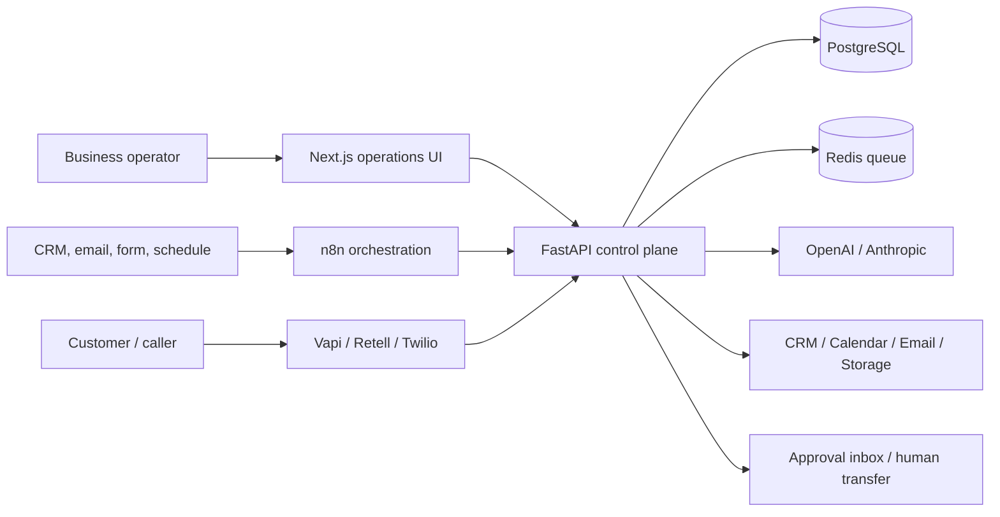
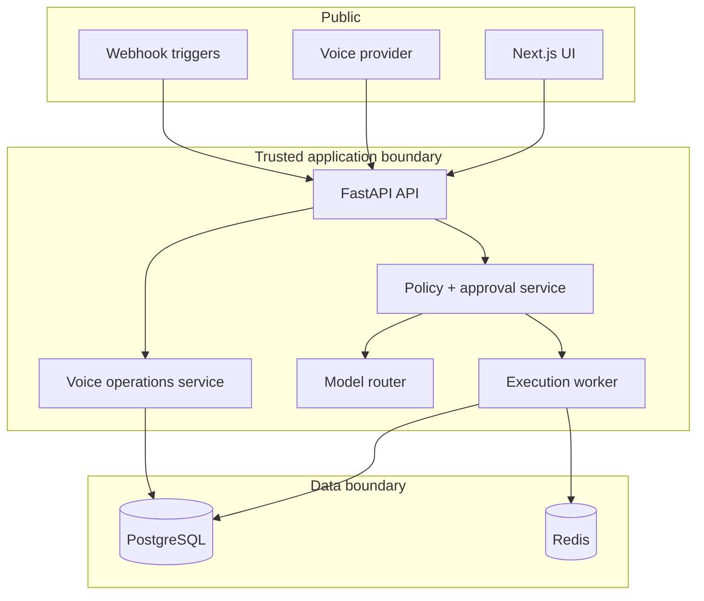
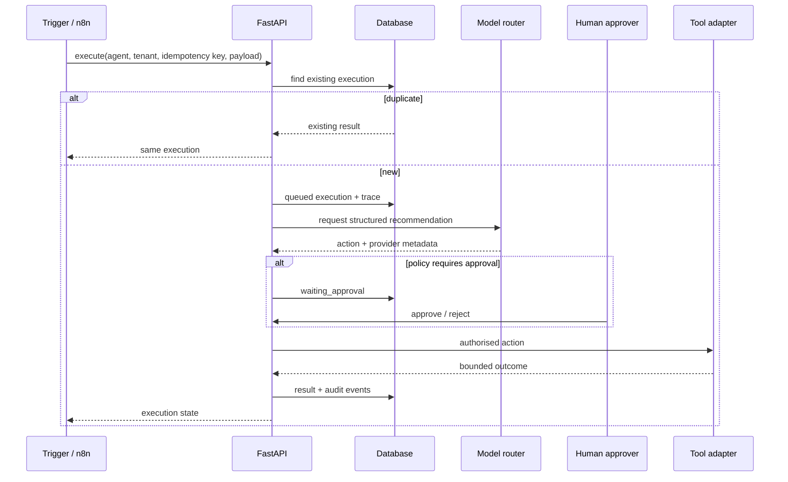

# System Architecture Studio Pack

## System context



## Containers and authority



The browser, n8n, voice provider, and model never become authoritative over customer records, payments, calendar state, or an approval decision. They request transitions. The application service validates tenant, policy, idempotency, current state, and operator approval before writing.

## Automation execution sequence



## Voice booking sequence

```mermaid
sequenceDiagram
  participant C as Caller
  participant V as Voice provider
  participant A as FastAPI tool service
  participant D as PostgreSQL
  participant CAL as Calendar adapter
  C->>V: request appointment
  V->>A: validated tool call with requested slot
  A->>D: begin conflict-safe reservation
  alt slot already reserved
    D-->>A: uniqueness conflict
    A-->>V: unavailable; request another slot
  else slot available
    A->>CAL: create external event
    CAL-->>A: event id
    A->>D: commit appointment + audit
    A-->>V: confirmed booking
  end
```

## Trust boundaries and threats

- Tenant IDs are checked before agent execution and data access.
- Idempotency prevents duplicate triggers and replayed provider callbacks from repeating side effects.
- Model output remains a recommendation until application policy authorises execution.
- Customer-facing or sensitive actions can be forced into human approval.
- Appointment state is protected by a unique database constraint, not by model memory.
- Emergency and low-confidence voice requests escalate instead of guessing.
- Failed human transfer falls back to a bounded message path and records the failure.
- Secrets, raw provider credentials, private prompts, and customer data are excluded from public artefacts.

## ADRs

### ADR-001: FastAPI owns agent state
n8n coordinates triggers and integrations, but the FastAPI service owns tenancy, execution state, approvals, retries, audit records, and tool authority. This prevents isolated workflows from becoming inconsistent sources of truth.

### ADR-002: Models recommend; services execute
Provider responses are structured proposals. Policy and service adapters decide whether an external action is valid, approved, idempotent, and current.

### ADR-003: Deterministic mock mode is first-class
Every core path runs without paid keys. This makes tests repeatable and lets reviewers verify architecture instead of trusting screenshots.

### ADR-004: Conflict prevention lives in the database
Appointment uniqueness is a transactional database concern. Conversational context cannot guarantee that two concurrent callers do not select the same slot.

### ADR-005: Human approval is a state, not a Slack message
An execution remains `waiting_approval` until an authenticated operator decision changes it. Notifications may announce the state but are not themselves approval.
